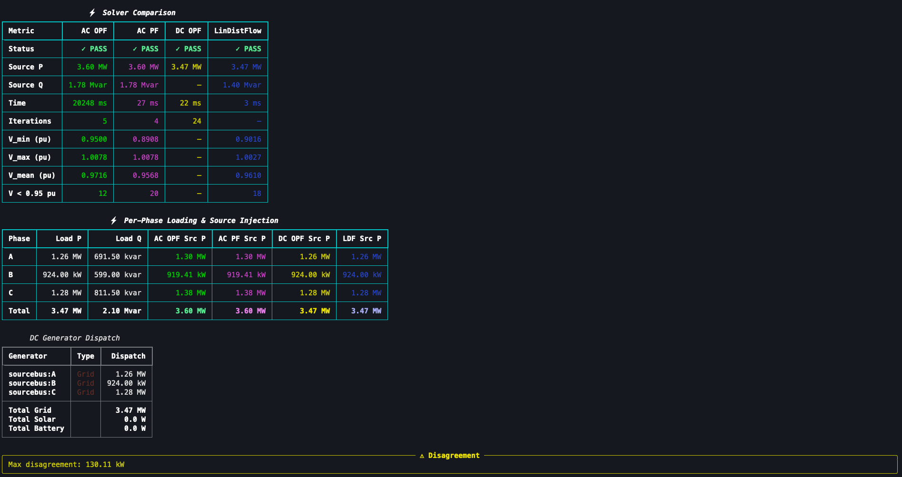

# gdm-flow

[](https://www.codefactor.io/repository/github/nlr-distribution-suite/gdm-flow) • [](https://codecov.io/github/NLR-Distribution-Suite/gmd-flow) • [](https://github.com/NLR-Distribution-Suite/gdm-flow/actions/workflows/ci.yml) • [](https://github.com/NLR-Distribution-Suite/gdm-flow/actions/workflows/docs.yml) • [](https://github.com/NLR-Distribution-Suite/gdm-flow/actions/workflows/publish.yml) •  •  • [](https://github.com/NLR-Distribution-Suite/gdm-flow/issues)


Utilities for OPF and power-flow style preprocessing on top of
`grid-data-models` distribution systems.



## Current features

- **Y-Bus Construction** — Phase-domain admittance matrices from GDM components (branches, transformers, switches) with matrix and sequence impedance support
- **Four Solvers** — AC OPF (nonlinear least-squares), AC PF (Newton-Raphson power flow), DC OPF (quadratic programming), and LinDistFlow (backward/forward sweep)
- **Multi-Phase Support** — Full three-phase and split-phase (center-tapped transformer) modeling
- **Component Integration** — Direct integration with GDM loads, solar PV, batteries, capacitors, and regulators
- **Interactive Dashboards** — Plotly-based HTML dashboards with voltage profiles, power flow, branch loading, losses, and equipment state
- **QSTS Simulation** — Quasi-static time series with warm-starting across timesteps for any solver
- **Multi-Period OPF** — Joint optimization across a time horizon with battery SOC coupling and ramp constraints (DC OPF and LinDistFlow)
- **Time Series Discovery** — Inspect available load, solar, and battery time series profiles in GDM models
- **Modern CLI** — Rich terminal interface with `info`, `run`, `compare`, `plot`, `export`, `ts-info`, `qsts`, `multiperiod`, `plot-ts`, and reporting commands
- **SQLite Export** — Structured database output with voltage/loading limit tracking, violation reporting, and streaming time series results
- **MCP Server** — Model Context Protocol server exposing all solvers as AI-callable tools

## Install

```bash
pip install -e .
```

If you also want sparse matrix return support:

```bash
pip install -e .[sparse]
```

If you want optimization support:

```bash
pip install -e '.[optimization]'
```

If you want interactive plotting dashboards:

```bash
pip install -e '.[plotting]'
```

If you want to run the MCP server:

```bash
pip install -e '.[mcp,optimization]'
gdm-flow-mcp-server
```

## Development checks

Install development dependencies and enable pre-commit hooks:

```bash
pip install -e '.[dev]'
pre-commit install
```

Run the same lint checks used in CI:

```bash
pre-commit run --all-files
```

## Examples

An end-to-end examples folder is included at `examples/` with a downloaded demo
distribution model and runnable scripts for each optimization flavor:

- `examples/models/p5r.json`
- `examples/run_ac_opf_example.py`
- `examples/run_dc_opf_example.py`
- `examples/run_lindistflow_example.py`
- `examples/compare_plotly_results.py` — interactive Plotly comparison across all solvers

Run from the repository root:

```bash
python examples/run_ac_opf_example.py
python examples/run_dc_opf_example.py
python examples/run_lindistflow_example.py
python examples/compare_plotly_results.py
```

## Usage

```python
from gdm.distribution import DistributionSystem
from gdm_flow import calculate_ybus

system = DistributionSystem.from_json("path/to/system.json")
result = calculate_ybus(system, include_shunt=False)

Y = result.ybus
labels = result.index_to_label
```

`labels[k]` is a `(bus_name, phase)` tuple for row/column `k` of `Y`.

## Optimization usage

```python
from gdm.distribution import DistributionSystem
from gdm_flow import optimize_ac_power_flow

system = DistributionSystem.from_json("path/to/system.json")

# Specify net nodal injections in SI units: +generation, -load
p_spec_w = {("bus_5", "A"): -20_000.0, ("bus_5", "B"): -20_000.0, ("bus_5", "C"): -20_000.0}
q_spec_var = {("bus_5", "A"): -5_000.0, ("bus_5", "B"): -5_000.0, ("bus_5", "C"): -5_000.0}

result = optimize_ac_power_flow(
  system,
  p_spec_w=p_spec_w,
  q_spec_var=q_spec_var,
)

print(result.success, result.final_objective)
```

### Auto-build specs from components

If your model already contains `DistributionLoad` and `DistributionSolar` components,
you can build nodal injections automatically:

```python
from gdm.distribution import DistributionSystem
from gdm_flow import optimize_ac_power_flow_from_components

system = DistributionSystem.from_json("path/to/system.json")

result = optimize_ac_power_flow_from_components(
  system,
  include_loads=True,
  include_solar=True,
  include_capacitor=True,
  include_battery=False,
  include_regulator_targets=True,
  include_regulator_limits=True,
)

print(result.success, result.final_objective)
```

Notes:

- `include_capacitor=True` adds capacitor reactive injections into nodal `Q` specs.
- `include_regulator_targets=True` adds soft voltage-target constraints derived from regulator controllers.
- `include_regulator_limits=True` adds hard voltage magnitude bounds from regulator min/max limits.

## AC Power Flow (Newton-Raphson)

`gdm-flow` includes a classical Newton-Raphson AC power flow solver. Unlike the AC OPF
which *optimises* voltage magnitudes within bounds, the AC PF solves for exact bus
voltages given fixed P/Q injections and a slack bus:

```python
from gdm.distribution import DistributionSystem
from gdm_flow import solve_ac_power_flow_from_components

system = DistributionSystem.from_json("path/to/system.json")

result = solve_ac_power_flow_from_components(
  system,
  include_loads=True,
  include_solar=True,
  include_capacitor=True,
)

print(result.success, result.iterations)
print(result.max_mismatch_pu)   # convergence metric
print(result.voltage_pu)        # per-unit voltage magnitudes
```

The solver uses sparse LU factorisation with a damped update and LinDistFlow warm-start
for robust convergence on heavily loaded feeders.

## DC OPF module

`gdm-flow` also includes a separate DC OPF module:

```python
from gdm.distribution import DistributionSystem
from gdm_flow import solve_dc_opf_from_components

system = DistributionSystem.from_json("path/to/system.json")

result = solve_dc_opf_from_components(
  system,
  include_solar_generators=True,
  include_battery_generators=True,
  include_loads=True,
)

print(result.success, result.objective)
print(result.generator_dispatch_w)
```

## LinDistFlow module

`gdm-flow` includes a separate radial LinDistFlow approximation module:

```python
from gdm.distribution import DistributionSystem
from gdm_flow import solve_lindistflow

system = DistributionSystem.from_json("path/to/system.json")

result = solve_lindistflow(system)

print(result.success)
print(result.voltage_v)     # {(bus, phase): voltage_in_volts}
print(result.p_flow_w)      # {(branch_name, phase): active_flow_w}
```

## SQLite export module

You can export results from AC OPF, DC OPF, and LinDistFlow into one SQLite database:

```python
from gdm_flow import export_all_results_to_sqlite

run_ids = export_all_results_to_sqlite(
  "results.sqlite",
  ac_result=ac_result,
  dc_result=dc_result,
  lindistflow_result=lindistflow_result,
)

print(run_ids)
```

Or export each result type separately:

- `export_ac_opf_result_to_sqlite(...)`
- `export_dc_opf_result_to_sqlite(...)`
- `export_lindistflow_result_to_sqlite(...)`

## Interactive dashboards

Generate interactive Plotly HTML dashboards from the CLI:

```bash
# Generate dashboard with all four solvers
gdm-flow plot examples/models/p5r.json

# Select specific solvers
gdm-flow plot examples/models/p5r.json -s ac -s pf

# Custom output path
gdm-flow plot examples/models/p5r.json -o my_dashboard.html
```

## Time series simulation

GDM-Flow supports time series simulation for models with time-varying load and solar
profiles. Two modes are available:

### QSTS (Quasi-Static Time Series)

Sequential snapshot solves at each timestep with automatic warm-starting:

```python
from gdm.distribution import DistributionSystem
from gdm_flow import run_qsts

system = DistributionSystem.from_json("model.json")

summary = run_qsts(
    system,
    solver="ldf",              # any solver: ac, pf, dc, ldf
    timestep_range=range(96),  # 24 hours at 15-min resolution
    db_path="qsts_results.db", # stream results to SQLite
)

print(f"Converged: {summary.num_converged}/{summary.num_timesteps}")
```

### Multi-Period OPF

Joint optimization across the time horizon with battery SOC coupling:

```python
from gdm_flow import solve_multiperiod_dc_opf
from gdm_flow.dc_opf import build_dc_generators_from_components

generators = build_dc_generators_from_components(system)

result = solve_multiperiod_dc_opf(
    system,
    generators=generators,
    timestep_range=range(96),
    ramp_limit_w=5000.0,
    db_path="multiperiod.db",
)

print(f"Objective: {result.objective:.2f}")
```

### CLI commands

```bash
# Check available time series
gdm-flow ts-info model.json

# QSTS simulation
gdm-flow qsts model.json --solver ldf --end 96 --db results.db

# Multi-period DC OPF
gdm-flow multiperiod model.json --solver dc --end 96 --ramp 5000 --db results.db

# Plot time series results
gdm-flow plot-ts results.db -o timeseries.html
```

The dashboard includes:
- Voltage-distance profiles along feeder paths
- Per-phase voltage comparison across solvers
- Branch power flow and loading analysis
- Line loss breakdown
- Equipment state (capacitors, regulators, transformers)

Requires the `plotting` extra: `pip install -e '.[plotting]'`

### CLI export from JSON

Use the CLI to load saved result JSON files and export to SQLite in one command:

```bash
gdm-flow-export --db results.sqlite --ac-json ac_result.json --dc-json dc_result.json --lindistflow-json ldf_result.json
```

Generate starter JSON templates:

```bash
gdm-flow-export --write-templates ./templates
```

This creates:

- `templates/ac_result.template.json`
- `templates/dc_result.template.json`
- `templates/lindistflow_result.template.json`

Expected JSON fields:

- AC JSON:
  - `success`, `message`, `iterations`, `initial_objective`, `final_objective`
  - `index_to_label`: `[["bus", "phase"], ...]`
  - `voltage`: `[{"real": ..., "imag": ...}, ...]`
  - `power_injection`: `[{"real": ..., "imag": ...}, ...]`
- DC JSON:
  - `success`, `message`, `objective`, `iterations`, `slack_injection_w`
  - `generator_dispatch_w`: `{name: value}`
  - `theta_rad`: `{"bus|phase": value, ...}`
  - `nodal_balance_w`: `{"bus|phase": value, ...}`
- LinDistFlow JSON:
  - `success`, `message`, `source_bus`
  - `voltage_v`, `p_flow_w`, `q_flow_var`, `p_net_w`, `q_net_var`
  - All series use `{"name|phase": value, ...}` format.
